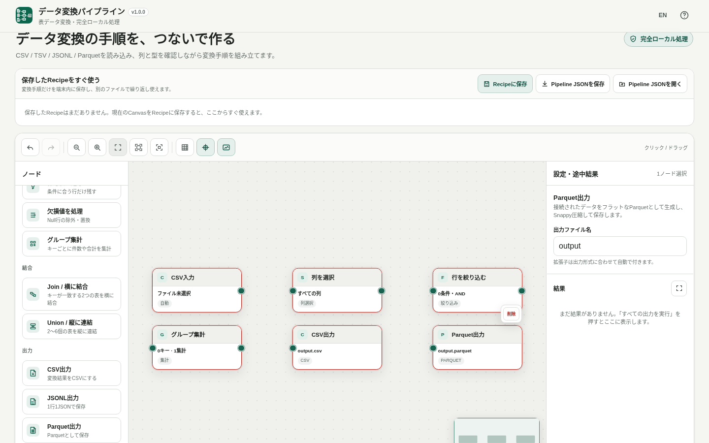

# Data Pipeline Builder / データ変換パイプライン

[](https://github.com/ttomohisa/htmlapps-data-pipeline-builder/actions/workflows/deploy-pages.yml)
[](LICENSE)
[](https://ttomohisa.github.io/htmlapps-data-pipeline-builder/)

[English README](README.md)

CSV / TSV / JSONL / Parquetの変換手順をノードで組み、別のファイルでも繰り返し使える完全ローカル処理のデータ変換ツールです。選択したデータファイルをアプリから外部サーバーへアップロードせず、ブラウザ内で処理します。

現在の対応範囲: `CSV / TSV / JSONL / Parquet Input → 各種変換 → Join / Union（縦に連結）→ Group By / グループ集計（件数・合計・平均・最小・最大）→ CSV / JSONL / Parquet Output`。CSV出力 / JSONL出力 / Parquet出力を同じパイプラインからまとめて作成できます。

## 🚀 デモ

### [GitHub PagesでData Pipeline Builderを開く](https://ttomohisa.github.io/htmlapps-data-pipeline-builder/)

GitHub Pagesから最初のHTMLを読み込んだ後、ファイル解析、変換、Join / Union、集計、途中結果Preview、Recipe実行、出力生成はブラウザ内で行われます。アプリで選択したファイルが外部サーバーへ送信されることはありません。

[](https://ttomohisa.github.io/htmlapps-data-pipeline-builder/)

## 主な機能

- **データ変換の手順をノードで組む** — Input、変換、Join / Union、Group By、Outputをつなぎ、毎回スクリプトを書かずに処理手順を作れます。
- **よく使う表形式を入出力** — CSV / TSV / JSONL / フラットなParquetを読み込み、CSV / JSONL / フラットなSnappy圧縮Parquetへ出力できます。
- **日常的な整形をまとめて処理** — 列選択、列名変更、並び替え、行数制限、型変換、重複除去、行の絞り込み、Null処理に対応します。
- **複数の表を結合・集計** — 2入力のJoin、2〜6入力のUnion、Count / Sum / Average / Min / Maxを使ったGroup Byに対応します。
- **途中結果を確認しながら作る** — 列名、推定型、Null / 空値件数、Parquet物理型、先頭100行までのPreviewを確認できます。
- **同じ手順を別ファイルで再利用** — Pipeline JSONでバックアップやGit管理を行うほか、端末内Recipeとして保存し、現在のCanvasを変えずに別ファイルへ実行できます。
- **複数形式をまとめて出力** — 1つの処理結果からCSV / JSONL / Parquetへ分岐し、まとめて実行した後、必要な結果だけ保存できます。
- **完全ローカル処理** — 単一HTML版は `connect-src 'none'`。入力ファイルはブラウザ内で扱い、結果も明示的に保存したときだけダウンロードします。

### 結合キーを「文字列を整える」で統一

入力 → 文字列を整える → 重複除去またはJoinの順につなぎます。対象列を1列以上選び、初期状態でONの「前後の空白を除去」と、必要に応じて「小文字にする」または「大文字にする」を設定します。大文字・小文字の初期値は「変更しない」です。例えば ` Alice ` と `ALICE` は空白除去＋小文字変換でともに `alice` になります。

文字列だけを変更し、Null・数値・真偽値、未選択列、行順・行数は変えません。標準JavaScriptのUnicode規則で空白除去を先に実行します。言語別変換や全角・半角の統一は行いません。未選択や存在しない列はエラーとして表示します。設定はUndo / Redoに対応し、Pipeline JSONとRecipeにも保存されます。

## すぐに使う

### Webで使う

[デモを開く](https://ttomohisa.github.io/htmlapps-data-pipeline-builder/)だけで利用できます。インストールやアカウント登録は不要です。

### 単一HTMLで使う

1. 生成済みの `dist/index.html` を用意します。
2. 現在のブラウザで開きます。
3. Inputノードを追加してローカルファイルを選び、必要な変換ノードとOutputノードをつなぎます。
4. **すべての出力を実行** を押し、結果一覧から必要なファイルを保存します。

単一HTML版のデータ処理にはサーバーが不要で、実行時の外部ネットワーク依存もありません。

### Self-extract版を使う

`dist/index.self-extract.html` には通常の単一HTMLをgzip圧縮して内包しています。`DecompressionStream` に対応したブラウザで開くと、端末内でHTMLを復元して通常版と同じアプリを起動します。

## 使い方

1. CSV / TSV、JSONL、ParquetのいずれかのInputノードを追加します。
2. Inspectorから入力ファイルを選択します。対応するファイル欄ではドラッグ＆ドロップも利用できます。
3. 必要な変換ノードをつなぎます。途中結果Previewで列や値を確認しながら進められます。
4. 複数の入力を扱う場合はJoinまたはUnion、集計する場合はGroup Byを追加します。
5. CSV / JSONL / Parquet Outputをつなぎます。1つの上流データから複数Outputへ分岐できます。
6. **すべての出力を実行** を押します。実行しただけではファイルは自動ダウンロードされません。
7. 結果を確認し、必要なら **保存ファイル名** を変更して保存します。

Canvasの結果カード・結果一覧・Quick Recipeの結果から、再実行せずに出力ごとの保存名を変更できます。CSV / JSONL / Parquetの拡張子は生成済みの形式に合わせて整え、入力済みでも重複させません。安全でない文字は置換し、空の名前は `output` にします。変更は現在の結果だけに適用し、出力設定・Pipeline JSON・Recipe・Undo / Redoは変更しません。再実行時は出力設定の名前に戻ります。

### Recipeで同じ処理を繰り返す

**Recipeに保存** すると、現在のノード構成と設定をこのブラウザ内へ保存できます。入力ファイル本体とファイル名はRecipeへ保存しません。

保存済みRecipeを展開すると、必要なInputごとにファイルを選択またはドラッグ＆ドロップできます。その後、次の2通りで利用できます。

- **このRecipeを使う** — 現在のCanvasを変更せず、指定した別ファイルでRecipeを実行します。
- **Canvasに反映** — 確認後、現在のCanvasを保存済みRecipeへ置き換えます。

Recipeは現在のブラウザプロファイル内に保存されます。サイトデータを削除すると消える可能性があるため、持ち運びやバックアップが必要な場合はPipeline JSONも利用してください。

### Pipeline JSON

Pipeline JSONにはノード、設定、接続、配置を保存します。元の `File` objectや出力結果は含みません。読み込むとCanvasを復元し、Inputファイルは再度選択します。

### 対応する処理

| 分類 | ノード / 処理 |
| --- | --- |
| 入力 | CSV / TSV、JSONL、Parquet |
| 基本変換 | 列を選択、列名を変更、並び替え、行数を制限、型を変換、重複を除去 |
| 絞り込み | 行を絞り込む、欠損値を処理 |
| 結合 | Join（Inner / Left / Right / Full）、Union（列名 / 列順） |
| 集計 | Group By + Count / Sum / Average / Min / Max |
| 出力 | CSV、JSONL、Parquet |

## GitHub Pagesで公開する

このリポジトリには、単一HTMLをビルド・検証して `dist/` をGitHub Pagesへ公開するワークフローが含まれています。

1. リポジトリを `htmlapps-data-pipeline-builder` としてGitHubへプッシュします。
2. **Settings → Pages → Build and deployment → Source** で **GitHub Actions** を選択します。
3. `main` へプッシュするか、Actions画面から **Deploy standalone app to GitHub Pages** を手動実行します。
4. 成功後、`https://ttomohisa.github.io/htmlapps-data-pipeline-builder/` で公開されます。

ワークフローではPowerShellの構文確認と `scripts/check-repository.ps1` を実行してからPages用artifactを作成します。

## 開発とビルド

```text
.
├─ src/
│  ├─ index.template.html        # アプリ本体テンプレート
│  ├─ core/node-editor-core.mjs  # Node Editor Core
│  ├─ data-table-utils.mjs       # 表データ変換 / CSV / JSONL処理
│  ├─ parquet-lite.mjs           # 軽量なフラットParquet Reader
│  ├─ parquet-write-lite.mjs     # 軽量なフラットParquet Writer
│  └─ recipe-utils.mjs           # Recipe / Pipeline保存処理
├─ tests/                        # Nodeベースの変換・Runtimeテスト
├─ assets/favicon.svg            # アプリアイコン / favicon
├─ app.config.json               # アプリ情報・単一HTMLビルド設定
├─ build-standalone.bat          # Windows用ビルド入口
├─ build-standalone.ps1          # 単一HTML生成
├─ scripts/                      # Repository / Offline / Self-extract検証
└─ dist/
   ├─ index.html                 # 生成される通常単一HTML
   └─ index.self-extract.html    # 生成されるSelf-extract版
```

### テスト

```powershell
npm test
```

### 単一HTMLを生成する

```powershell
.\build-standalone.bat
```

ビルド時にNode Editor Core、表データ処理、Recipe utilities、軽量Parquet Reader / Writer、アプリアイコン、設定済み依存assetを単一HTMLへ内包します。Repository checkではCSP、未置換placeholder、実行時ネットワーク制限、Self-extract版も検証します。

## プライバシーと外部通信

生成されるアプリは完全ローカル処理を前提にしています。

- 選択したファイルはBrowser File APIで読み込み、このアプリから外部へアップロードしません。
- 単一HTML版は `connect-src 'none'` で実行時通信を遮断します。
- DuckDB-WASMやApache Arrowを実行時に取得しません。
- `File` objectは実行中のメモリにだけ保持し、Pipeline JSONやRecipeへ保存しません。
- 出力は端末内で生成し、ユーザーが明示的に保存操作をした場合だけダウンロードします。

GitHub Pages版では最初にHTMLを取得する通信は発生します。ネットワークを切った状態で使う場合は、生成済みの `dist/index.html` をローカルで開いてください。

## 制限事項

- 入力はCSV / TSV / JSONL / Parquet、出力はCSV / JSONL / Parquetです。
- 文字コードはUTF-8を基本対応とします。
- Parquet入力はフラットなSchemaのみ対応し、ネスト / Repeated列は黙って展開せずエラーにします。
- Parquet入力は、現在のフラットSchema対応範囲でUncompressed / Snappy / GZIPのページを扱います。
- Parquet出力はフラット形式・Snappy圧縮です。
- Sum / Averageの対象に数値以外が含まれる場合は、黙って型変換せずエラーにします。
- Nullと空文字は別の値として扱います。
- Previewは先頭100行までですが、Sort / Deduplicate / Join / Union / Group Byなどは上流データ全体を処理してからPreviewを切り出します。
- 実用的なファイルサイズはブラウザや端末のメモリに依存します。
- Recipeは現在のブラウザプロファイル内に保存されるため、必要に応じてPipeline JSONでもバックアップしてください。

## 使用しているコード / 参考実装

汎用データベースエンジンは内包せず、CSV / TSV / JSONL処理とフラットParquet Writerはアプリ内で実装しています。軽量Parquet Readerでは、以下のMITライセンスプロジェクトの一部ロジックを参考・移植しています。

| プロジェクト | 参照バージョン | ライセンス | 用途 |
| --- | ---: | --- | --- |
| Node Editor Core | 1.1.0 | MIT | Node Canvas、Viewport、Port、Validation、Serialization |
| hyparquet | 1.30.1 | MIT | フラットParquet解析ロジックの参考 |
| snappyjs | — | MIT | Snappy展開ロジックの参考 |

詳細は [THIRD_PARTY_NOTICES.md](THIRD_PARTY_NOTICES.md) を確認してください。

## コントリビューション

バグ報告や機能提案はGitHub Issuesからお願いします。開発への参加方法は [CONTRIBUTING.md](CONTRIBUTING.md) を確認してください。

## ライセンス

Copyright © 2026 ttomohisa

このプロジェクトは [MIT License](LICENSE) で公開されています。
