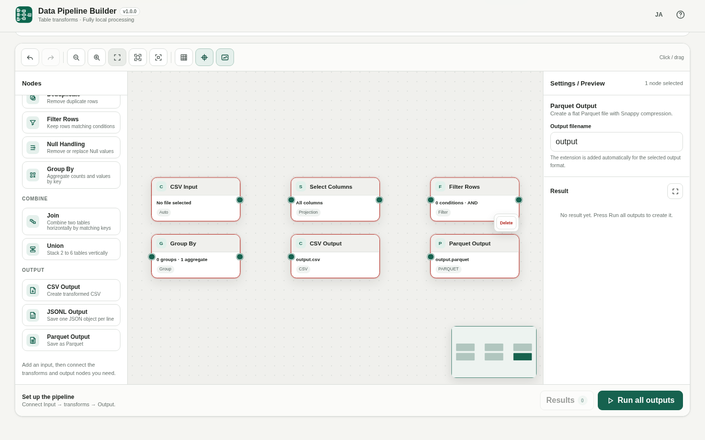

# Data Pipeline Builder

[](https://github.com/ttomohisa/htmlapps-data-pipeline-builder/actions/workflows/deploy-pages.yml)
[](LICENSE)
[](https://ttomohisa.github.io/htmlapps-data-pipeline-builder/)

[日本語版 README](README.ja.md)

A node-based, fully local browser tool for building repeatable CSV / TSV / JSONL / Parquet transformation pipelines without uploading selected data files to a server.

Current pipeline scope: `CSV / TSV / JSONL / Parquet Input → transforms → Join / Union → Group By → CSV Output / JSONL Output / Parquet Output`.

## 🚀 Live demo

### [Open Data Pipeline Builder on GitHub Pages](https://ttomohisa.github.io/htmlapps-data-pipeline-builder/)

GitHub Pages delivers the initial HTML. After it loads, file parsing, transforms, joins, aggregation, preview, Recipe execution, and output generation run locally in the browser. Files selected in the app are not uploaded by the app.

[](https://ttomohisa.github.io/htmlapps-data-pipeline-builder/)

## Features

- **Build transformations visually** — Connect Input, Transform, Join / Union, Group By, and Output nodes instead of writing a one-off script for every file.
- **Work with common table formats** — Read CSV / TSV / JSONL / flat Parquet and write CSV / JSONL / flat Snappy-compressed Parquet.
- **Handle everyday cleanup steps** — Select or rename columns, sort, limit rows, cast types, clean text, deduplicate, filter rows, and handle Null values.
- **Combine and aggregate tables** — Join two inputs, Union 2–6 inputs, or group rows with Count / Sum / Average / Min / Max.
- **Inspect intermediate results** — Check column names, inferred types, Null / empty counts, Parquet physical types, and up to 100 preview rows while building the pipeline.
- **Reuse the same process** — Save a Pipeline JSON for backup or Git tracking, or keep a Recipe in the current browser and run it with different input files without replacing the current Canvas.
- **Create several outputs at once** — Fan out one pipeline to CSV / JSONL / Parquet outputs, run them together, preview the results, then save only the files you need.
- **Fully local processing** — The standalone app uses `connect-src 'none'`; selected data files stay in the browser and outputs are saved only when you explicitly choose to save them.

### Clean Text before matching keys

Connect Input → Clean Text → Deduplicate or Join. Select one or more columns, keep **Trim leading and trailing whitespace** on (the default), and optionally choose **Lowercase** or **Uppercase**. Case starts **Unchanged**. For example, ` Alice ` and `ALICE` both become `alice` with Trim + Lowercase.

Only strings change; Null, numbers, booleans, other columns, row order and row count stay unchanged. Trim runs first using standard JavaScript Unicode rules. This does not perform locale-specific case conversion or full-width/half-width normalization. Missing columns and empty selections are errors. Settings support Undo / Redo and are included in saved Pipeline JSON and Recipes.

## Quick start

### Use the web demo

Just [open the demo](https://ttomohisa.github.io/htmlapps-data-pipeline-builder/). No installation or account is required.

### Use the standalone HTML

1. Build or download the generated `dist/index.html`.
2. Open the file in a current browser.
3. Add an Input node, select a local file, connect the transforms you need, then connect one or more Output nodes.
4. Choose **Run all outputs** and save the generated files from the result list.

The standalone HTML does not need a server for data processing and has no runtime network dependency.

### Use a self-extracting HTML

`dist/index.self-extract.html` contains a gzip-compressed copy of the normal standalone HTML. Open it in a browser with `DecompressionStream` support; it restores the app locally and then runs the same standalone build.

## Usage

1. Add a CSV / TSV, JSONL, or Parquet Input node.
2. Choose the source file from the Inspector, or drop a file into supported file areas.
3. Connect the transform nodes you need. Intermediate previews help you confirm the result before export.
4. For two or more inputs, use Join or Union. For summaries, add Group By and configure one or more aggregations.
5. Connect CSV, JSONL, or Parquet Output nodes. One upstream table can fan out to several outputs.
6. Select **Run all outputs**. Running the pipeline does not automatically download anything.
7. Review each output and save the files you want.

### Reuse with Recipes

Use **Save Recipe** to keep the current graph structure and settings in this browser. Input file contents and filenames are not stored in the Recipe.

When you expand a saved Recipe, assign each required input with the file picker or drag and drop. Then choose:

- **Use this Recipe** — Run it with the assigned files without replacing the current Canvas.
- **Apply to Canvas** — Replace the current Canvas with the saved pipeline after confirmation.

Recipes are stored in the current browser profile. Clearing site data can remove them, so use Pipeline JSON when you need a portable backup.

### Pipeline JSON

Pipeline JSON stores nodes, settings, connections, and layout. It intentionally excludes source `File` objects and generated output data. Opening a Pipeline JSON restores the graph and asks you to select the input files again.

### Supported transforms

| Category | Nodes / operations |
| --- | --- |
| Input | CSV / TSV, JSONL, Parquet |
| Basic transforms | Select Columns, Rename Columns, Sort, Limit, Cast, Deduplicate |
| Filtering | Filter Rows, Null Handling |
| Combine | Join (Inner / Left / Right / Full), Union by name or position |
| Aggregate | Group By with Count / Sum / Average / Min / Max |
| Output | CSV, JSONL, Parquet |

## Publish with GitHub Pages

The repository includes a workflow that builds the standalone HTML, verifies the repository, and deploys `dist/` to GitHub Pages.

1. Push the repository to GitHub as `htmlapps-data-pipeline-builder`.
2. Open **Settings → Pages → Build and deployment → Source** and select **GitHub Actions**.
3. Push to `main`, or manually run **Deploy standalone app to GitHub Pages** from the Actions tab.
4. After a successful deployment, the app is available at `https://ttomohisa.github.io/htmlapps-data-pipeline-builder/`.

The workflow runs the PowerShell syntax check and `scripts/check-repository.ps1` before uploading the Pages artifact.

## Development and build layout

```text
.
├─ src/
│  ├─ index.template.html        # Application template
│  ├─ core/node-editor-core.mjs  # Embedded node editor runtime
│  ├─ data-table-utils.mjs       # Table transforms / CSV / JSONL helpers
│  ├─ parquet-lite.mjs           # Lightweight flat Parquet reader
│  ├─ parquet-write-lite.mjs     # Lightweight flat Parquet writer
│  └─ recipe-utils.mjs           # Recipe / Pipeline serialization helpers
├─ tests/                        # Node-based transform/runtime tests
├─ assets/favicon.svg            # App icon / favicon
├─ app.config.json               # App metadata and standalone build settings
├─ build-standalone.bat          # Windows build entry point
├─ build-standalone.ps1          # Standalone HTML builder
├─ scripts/                      # Repository, offline and self-extract verification
└─ dist/
   ├─ index.html                 # Generated standalone app
   └─ index.self-extract.html    # Generated self-extracting app
```

### Run tests

```powershell
npm test
```

### Build the standalone files

```powershell
.\build-standalone.bat
```

The build embeds Node Editor Core, table utilities, Recipe utilities, the lightweight Parquet reader / writer, the app icon, and configured dependency assets into the standalone HTML. The repository checks also validate CSP, unresolved placeholders, runtime-network restrictions, and the self-extract build.

## Privacy and runtime network protection

The generated app is designed for fully local processing:

- Selected files are read with browser file APIs and are not uploaded by this app.
- `connect-src 'none'` blocks runtime network connections from the standalone app.
- No DuckDB-WASM or Apache Arrow runtime is downloaded.
- `File` objects stay in runtime memory and are excluded from Pipeline JSON and Recipes.
- Outputs are generated locally and are downloaded only after an explicit save action.

The GitHub Pages version still requires the initial request to load the HTML page. For use with the network disconnected, open the generated `dist/index.html` locally.

## Limitations

- Input formats are CSV / TSV / JSONL / Parquet. Output formats are CSV / JSONL / Parquet.
- UTF-8 is the primary supported text encoding.
- Parquet input is limited to flat schemas; nested / repeated columns are rejected instead of being silently flattened.
- Parquet input supports Uncompressed, Snappy, and GZIP-compressed pages within the currently implemented flat-schema scope.
- Parquet output is flat and Snappy-compressed.
- Sum and Average require numeric values; invalid aggregate input is reported instead of being coerced silently.
- Null and empty strings are treated as different values.
- Preview shows up to 100 rows, although transforms such as Sort, Deduplicate, Join, Union, and Group By operate on the full upstream table before preview truncation.
- Practical file size depends on browser and device memory because processing is local.
- Recipes live only in the current browser profile unless you also keep a Pipeline JSON backup.

## Dependencies and adapted code

The runtime intentionally avoids a general-purpose database engine. CSV / TSV / JSONL handling and the flat Parquet writer are built into the app. The lightweight Parquet reader adapts selected logic from the MIT-licensed projects below.

| Project | Reference version | License | Purpose |
| --- | ---: | --- | --- |
| Node Editor Core | 1.1.0 | MIT | Node canvas, viewport, ports, validation, serialization |
| hyparquet | 1.30.1 | MIT | Reference logic for flat Parquet parsing |
| snappyjs | — | MIT | Reference logic for Snappy decompression |

See [THIRD_PARTY_NOTICES.md](THIRD_PARTY_NOTICES.md) for details.

## Contributing

Bug reports and feature proposals are welcome through GitHub Issues. See [CONTRIBUTING.md](CONTRIBUTING.md) for development guidance.

## License

Copyright © 2026 ttomohisa

Licensed under the [MIT License](LICENSE).
